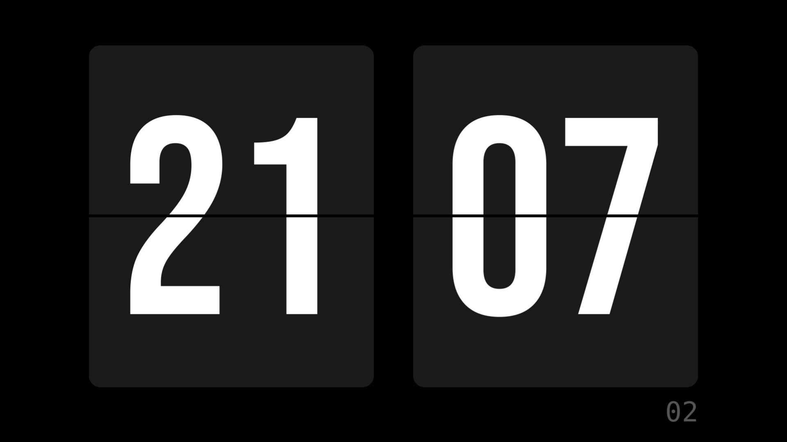

# FlipClock

Minimal desktop flip clock widget built with Go and Fyne v2.



## Features

- Hour and minute flip cards with animation (300ms, ease-in-out, two phases)
- Responsive layout that adapts to the window size
- Fullscreen mode (`F` / `F11` keys)
- System tray with menu (Show / Fullscreen / Quit)
- Closing the window minimizes to tray (app keeps running)
- Bebas Neue font embedded in the binary (zero external file dependencies)
- Dark mode theme with minimalist palette
- 24-hour format

## Stack

| Component | Technology |
|-----------|-----------|
| Language | [Go](https://go.dev/) 1.22+ |
| GUI | [Fyne](https://fyne.io/) v2.5.1 |
| Font | [Bebas Neue](https://fonts.google.com/specimen/Bebas+Neue) (OFL) |
| System Tray | [fyne.io/systray](https://github.com/nicoria/systray) |
| Rendering | OpenGL (via go-gl) |

## Prerequisites

- **Go 1.22+** ([download](https://go.dev/dl/))
- **C/C++ compiler** and OpenGL libraries (required by Fyne):

**Linux (Debian/Ubuntu):**

```bash
sudo apt install gcc libgl1-mesa-dev xorg-dev
```

**macOS:**

```bash
xcode-select --install
```

**Windows:**

- [TDM-GCC](https://jmeubank.github.io/tdm-gcc/) or MSYS2

## Installation and usage

```bash
# Clone the repository
git clone https://github.com/nandomoreirame/flipclock-app.git
cd flipclock-app

# Download dependencies
go mod tidy

# Run directly
go run .

# Build binary
go build -o flipclock .

# Build optimized binary (smaller, no debug symbols)
go build -ldflags "-s -w" -o flipclock .

# Linux/macOS: run in background
./flipclock &

# Windows (no console window)
go build -ldflags "-s -w -H windowsgui" -o flipclock.exe .
```

## Keyboard shortcuts

| Key | Action |
|-----|--------|
| `Esc` | Exit fullscreen, or minimize to tray |
| `Q` | Minimize to tray |
| `F` or `F11` | Toggle fullscreen |

## System Tray menu

| Item | Action |
|------|--------|
| Show | Display and focus the window |
| Fullscreen | Toggle fullscreen |
| Quit | Close the application |

### Tray on Linux (GNOME)

Vanilla GNOME does not display tray icons natively. Install the AppIndicator extension:

```bash
sudo apt install gnome-shell-extension-appindicator
# Restart the session or GNOME Shell
```

KDE, XFCE, macOS and Windows work out-of-the-box.

## Project structure

```
flipclock-app/
├── main.go                      # Application (widgets, layout, tray, loop)
├── font.go                      # Embedded font via go:embed
├── bundled.go                   # Embedded icon via fyne bundle
├── fonts/
│   └── BebasNeue-Regular.ttf    # Display font (61KB, OFL license)
├── images/
│   ├── flipclock.png            # App icon (256x256)
│   ├── flipclock@2x.png         # Retina icon (512x512)
│   └── flipclock.svg            # Vector icon
├── install.sh                   # Automatic installer (Linux/macOS/Windows)
├── flipclock.desktop            # Desktop entry for Linux
├── FyneApp.toml                 # App metadata for fyne package
├── go.mod                       # Go module definition
├── go.sum                       # Dependency checksums
├── CLAUDE.md                    # Claude Code instructions
└── README.md                    # This file
```

### main.go sections

| Section | Lines | Description |
|---------|-------|-------------|
| Colors | 16-26 | Dark mode palette (`#000`, `#1A1A1A`, `#FFF`, `#555`) |
| flipTheme | 28-57 | Custom Fyne theme (colors + BebasNeue font) |
| FlipCard | 59-200 | Custom widget with renderer and flip animation |
| clockLayout | 202-265 | Responsive layout with 5:6 card aspect ratio |
| Clock | 267-290 | Clock state + `Update()` method + `pad2` helper |
| main() | 292-402 | App setup, tray, shortcuts, 1-second ticker loop |

## Flip animation

The animation uses `fyne.NewAnimation()` with a 300ms duration and ease-in-out curve, split into two phases:

1. **Phase 1 (0-50%):** The top flap shrinks from the top toward the central hinge, revealing the new digit above
2. **Phase 2 (50-100%):** The bottom flap shrinks from the bottom toward the hinge, revealing the new digit below

The flaps use the same color as the card (`#1A1A1A`), simulating the mechanical effect of a real flip clock.

## System installation

The easiest way to install is using the automatic script:

```bash
./install.sh
```

The script detects the OS (Linux, macOS, Windows), installs required dependencies, compiles the optimized binary, and registers the app in the system launcher.

To uninstall:

```bash
./install.sh --uninstall
```

### What install.sh does per OS

**Linux (Debian/Ubuntu/Fedora/Arch):**

- Installs gcc and OpenGL libraries (asks for confirmation before using sudo)
- Compiles the optimized binary
- Installs to `~/.local/bin/flipclock`
- Registers icon and .desktop entry in the launcher

**macOS:**

- Checks for Xcode CLI tools
- Compiles and creates a .app bundle with Info.plist and .icns icon
- Installs to `~/Applications/FlipClock.app`

**Windows (MSYS2/Git Bash):**

- Checks for gcc (TDM-GCC or MSYS2)
- Compiles .exe without console window
- Installs to `%LOCALAPPDATA%\FlipClock\`
- Creates Start Menu shortcut

### Manual installation

If you prefer to install manually, see the instructions per OS:

<details>
<summary>Linux (manual)</summary>

```bash
go build -ldflags "-s -w" -o flipclock .
cp flipclock ~/.local/bin/
mkdir -p ~/.local/share/icons/hicolor/256x256/apps
cp images/flipclock.png ~/.local/share/icons/hicolor/256x256/apps/flipclock.png
cp flipclock.desktop ~/.local/share/applications/com.flipclock.app.desktop
gtk-update-icon-cache ~/.local/share/icons/hicolor/
update-desktop-database ~/.local/share/applications/
```

</details>

<details>
<summary>macOS (manual with fyne package)</summary>

```bash
go install fyne.io/tools/cmd/fyne@latest
fyne package -os darwin -icon images/flipclock.png -name FlipClock -appID com.flipclock.app
mv FlipClock.app /Applications/
```

</details>

<details>
<summary>Windows (manual with fyne package)</summary>

```bash
go install fyne.io/tools/cmd/fyne@latest
fyne package -os windows -icon images/flipclock.png -name FlipClock -appID com.flipclock.app
```

</details>

## Roadmap

- [x] Flip animation (two-phase, 300ms ease-in-out)
- [x] Responsive layout (proportional to window size)
- [x] Fullscreen (F/F11 + tray menu)
- [x] Embedded custom font (Bebas Neue)
- [x] Custom icon for app, window, and tray
- [ ] 12h/24h toggle (via tray menu)
- [ ] Always-on-top
- [ ] Light theme
- [ ] Persistent settings (JSON)

## Contributing

1. Fork the repository
2. Create a branch for your feature (`git checkout -b feature/my-feature`)
3. Commit your changes (`git commit -m "feat: feature description"`)
4. Push to the branch (`git push origin feature/my-feature`)
5. Open a Pull Request

### Conventions

- Commits follow [Conventional Commits](https://www.conventionalcommits.org/)
- Code, variables, and comments in English
- Tests with `go test ./...`

## Credits

- **Font:** [Bebas Neue](https://fonts.google.com/specimen/Bebas+Neue) by Ryoichi Tsunekawa (SIL Open Font License)
- **GUI:** [Fyne](https://fyne.io/) toolkit for Go

## License

MIT
